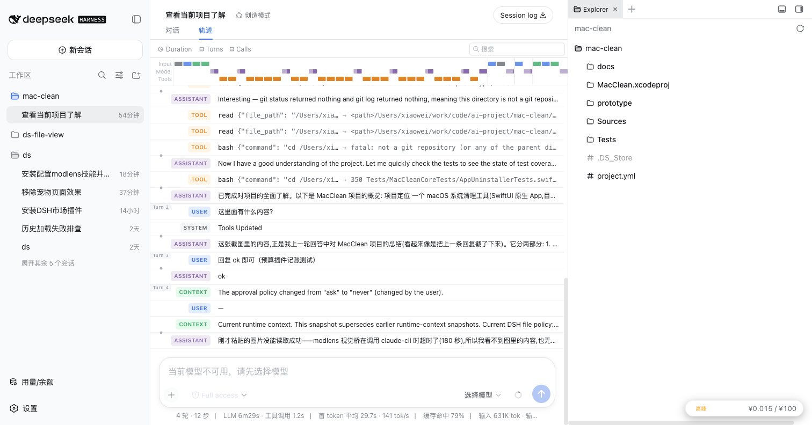
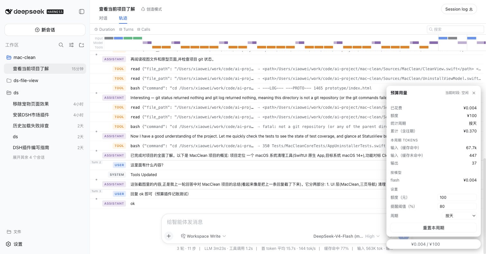

# ds-budget-meter

DeepSeek Harness（`dsh`）的 **token 预算提醒插件**：把会话的 token 消耗按 DeepSeek V4
官方峰谷定价实时折算成人民币，在右下角显示悬浮进度胶囊；接近 / 超过额度时提醒，
超额时默认自动停止当前回合。





## 功能

- **右下角悬浮胶囊**：当前峰谷时段标签（高峰 / 空闲）+ 迷你进度条 + `已花 / 额度`；
- **展开卡片**：进度百分比、本周期 token 分项（输入缓存命中 / 输入缓存未命中 / 输出）、
  按模型分花费、统计周期与**累计（含往期）**、设置区、「重置本周期」；
- **官方峰谷定价**（元/百万 tokens，与 [DeepSeek 价目表](https://api-docs.deepseek.com/zh-cn/quick_start/pricing) 一致）：

  | 模型 | 输入（缓存命中） | 输入（缓存未命中） | 输出 |
  |---|---|---|---|
  | flash | 闲 0.05 / 峰 0.10 | 闲 1.5 / 峰 3.0 | 闲 4.5 / 峰 9.0 |
  | pro | 闲 0.15 / 峰 0.30 | 闲 4.5 / 峰 9.0 | 闲 13.5 / 峰 27.0 |

  高峰时段默认北京时间 **9:00–12:00、14:00–18:00**（可配置），其余为空闲时段；
- **模型自动识别**：只按供应商（DeepSeek）过滤，每条请求按自己的模型名自动选
  flash / pro 档——频繁切换模型无需任何配置；
- **额度周期**：按天（默认，自然日零点重置）/ 按月 / 累计；
- **提醒与停止**：达到提醒阈值（默认 80%）弹 8 秒 toast；达到 100% 显示**常驻横幅**
  （手动关闭），且默认**自动取消当前回合**停止继续消耗（`stopOnOver`，每周期一次，可关）；
- 中 / 英双语。

## 环境要求

- DeepSeek Harness **0.1.0-rc.6** 版本通道（`dsh` CLI 与运行时同通道）；
- Node.js ≥ 22、pnpm。

## 安装

### 方式一：npm 注册表按名字安装（推荐）

包发布到 npm 后（见下文「发布」），与 dsh-context 等插件同款一行安装：

```sh
dsh plugin --profile web add ds-budget-meter           # latest
dsh plugin --profile web add ds-budget-meter@0.1.0     # 指定版本
```

然后**重启** profile / 应用，浏览器 **Cmd+Shift+R 强刷**。

### 方式二：源码安装（未发布 / 开发时）

#### 1. 克隆并构建

```sh
git clone git@github.com:ai-suifeng/dsh-budget-meter.git
cd dsh-budget-meter
pnpm install
pnpm build        # 产出 lib/index.js（host）+ lib/client.js（client bundle）
```

#### 2. 安装到 profile

桌面应用默认 profile 为 `web`；`DSH_HOME` 默认为 `~/.dsh`
（桌面应用为 `~/Library/Application Support/deepseek-harness-desktop/harness-home`）。

```sh
# 标准方法（dsh CLI 与运行时须同版本通道 rc.6；pnpm 需在 PATH）
dsh plugin --profile web add "$(pwd)"
```

> **已知问题（重要）**：rc.6 的 `dsh plugin add` 在重写 profile manifest 时可能把
> 其它已有的 `link:` 插件从 `dependencies` / `dsh.profile.bundles` 中移除。
> 若发生，手工编辑 `~/.dsh/profiles/web/package.json` 补回后在 profile 目录执行
> `pnpm install` 即可（见下文「手工安装」）。

#### 3. 手工安装（不用 CLI 时的等价做法）

在 `~/.dsh/profiles/web/package.json` 中加入：

```jsonc
{
  "dependencies": {
    "ds-budget-meter": "link:/绝对路径/dsh-budget-meter"
    // ...其它依赖
  },
  "dsh": {
    "profile": {
      "bundles": [
        "@deepseek-ai/dsh-base",
        "@deepseek-ai/dsh-web-app",
        // ...其它 bundle
        "ds-budget-meter"
      ]
    }
  }
}
```

然后 `cd ~/.dsh/profiles/web && pnpm install`。

#### 4. 生效

- **重启** profile / 应用（host 组合树只在启动时加载）；
- 浏览器 **Cmd+Shift+R 强刷**页面（client 名册在页面加载时注入；已打开的旧页面
  不会自动拿到新 bundle）。

## 发布（维护者）

```sh
NPM_TOKEN=<npmjs token> ./scripts/publish.sh          # 已发布过则自动 bump patch
NPM_TOKEN=<token> ./scripts/publish.sh minor          # 强制 bump 类型
NPM_OTP=<6位码> NPM_TOKEN=<token> ./scripts/publish.sh  # 2FA 账号
```

脚本流程：构建 `lib/` → 版本已在注册表则自动 bump → `npm publish --access public`
→ `npm view` 验证上线。token 只从环境变量读取，不落盘。

## 配置

默认值（可通过 profile patch 的插件 `config` 覆盖；也可直接在卡片设置区修改，
存 localStorage、优先于 Config）：

```yaml
budgetYuan: 100          # 额度（元）
period: daily            # daily | monthly | total
warnPercent: 80          # 提醒阈值（%）
stopOnOver: true         # 超额时自动取消当前回合（每周期一次）
peakWindows: '09:00-12:00,14:00-18:00'   # 高峰窗口，北京时间，逗号分隔 HH:MM-HH:MM
pricingTimezone: Asia/Shanghai
```

## 工作原理

- **数据源**：client 插件订阅当前会话的 conversation 快照，对每条 finalized assistant
  消息的 `usage` 计费。Harness 的 wire 形状为
  `{ inputTokens, outputTokens, cacheReadTokens, reasoningTokens }`，其中
  `inputTokens` 是**未缓存**新输入、`cacheReadTokens` 是缓存命中输入（二者互斥，
  总输入 = 和；已用原始 session log 与状态栏「输入 / 缓存命中 / 输出」对账验证）；
  OpenAI 式形状（`prompt_tokens` 含缓存）作 fallback；
- **供应商网关**：`provider` / `model` 已知且不含 `deepseek` 才排除；历史回放节点不带
  身份时按本部署仅有 DeepSeek 处理，照计不误；模型名含 `pro` 走 pro 价，其余走 flash 价；
- **账本**：以 `sessionId:messageId|seq` 去重，localStorage 持久化——重复扫描、重开会话、
  重启应用都不会重复计费；
- **触发时机**：插件加载即 scan；订阅快照事件实时累加；会话 face 懒物化失败时 3 秒重试
  重挂；`connection/reset` 后自动重挂；
- **host 面**为 no-op 行，仅占组合树座位（承载 bundle patch 与 client 名册声明）。

## 开发

```sh
pnpm typecheck   # 双 program（host + client）
pnpm build       # tsc host → tsc client → tsdown
pnpm verify      # 离线冒烟：定价全组合 / 峰谷边界 / usage 形状 / 账本去重 / bundle 执行
```

## 边界与限制

- 仅统计**在本客户端打开 / staged 过**的会话消耗（框架无跨会话 usage 聚合面）；
  账本持久化保证打开过的会话不重不漏、重启不丢；
- 历史回放节点不带模型身份时按 flash 价计（宁晚提醒不早报）；
- 中断未 finalize 的请求没有 usage，不计费（保守少计）；
- 缓存命中数缺失时按 0 命中、全部输入走未命中价（保守高估）；
- 周期边界按浏览器本地时区的自然日 / 自然月；跨天归零后卡片「累计（含往期）」仍可见；
- 文本按 UTF-8 计费统计，与账单的微小舍入差异属正常。

## 许可

内部工具，按需自用。
